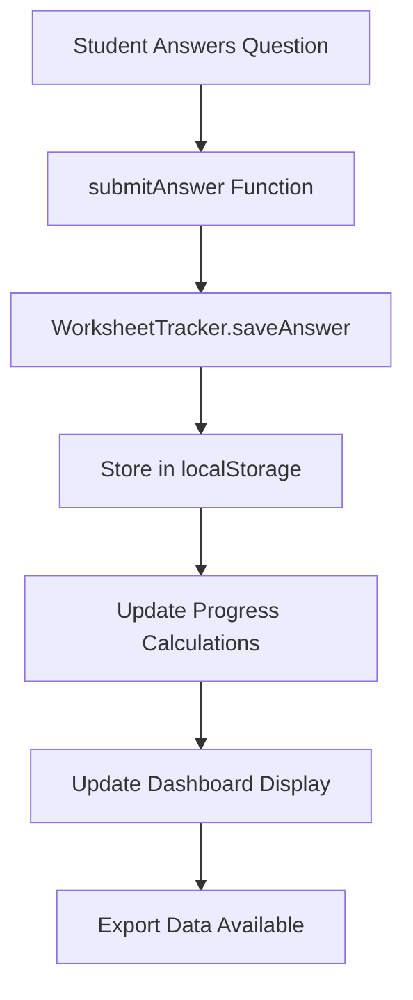

# Progress Tracker Implementation Guide

## Project Overview

This document details the implementation of a comprehensive worksheet tracking and export system for the Matrix TSL educational platform. The system tracks student progress across 14 maintenance worksheets and 8 fault scenarios, providing detailed analytics and export functionality for teachers.

## Implementation Summary

### What Was Built

1. **Core Tracking Engine** (`worksheet-tracking.js`)
   - JavaScript class-based system for managing progress data
   - Local storage integration for persistent data
   - Real-time progress calculations and statistics

2. **Interactive Dashboard** (`tracking-dashboard.html`)
   - Visual progress interface with real-time updates
   - Student information management
   - Export functionality (JSON, CSV, PDF)

3. **System Integration**
   - Enhanced all existing worksheets with tracking capabilities
   - Updated navigation menus across the entire platform
   - Backward-compatible with existing functionality

4. **Testing Infrastructure** (`test-tracking.html`)
   - Comprehensive testing interface
   - Data simulation capabilities
   - Export verification tools

## Technical Architecture

### Core Components

#### 1. WorksheetTracker Class

```javascript
class WorksheetTracker {
  constructor() {
    this.worksheets = {
      maintenance: [/* 14 worksheets */],
      fault: [/* 8 scenarios */]
    };
  }
  
  // Core methods:
  saveAnswer(worksheetId, questionNumber, answer, type)
  getWorksheetProgress(worksheetId, type)
  getAllProgress()
  updateOverallProgress()
  exportForTeacher()
  exportToJSON()
  exportToCSV()
  exportToPDF()
}
```

**Key Features:**
- Manages 22 total worksheets (14 maintenance + 8 fault)
- Stores answers, timestamps, and metadata
- Calculates completion percentages automatically
- Provides multiple export formats

#### 2. Data Storage Structure

```javascript
// Answer storage
worksheet-{type}-{id}-answers: { questionNumber: answer }

// Timestamp tracking
worksheet-{type}-{id}-timestamps: { questionNumber: ISO_timestamp }

// Metadata
worksheet-{type}-{id}-metadata: { 
  lastUpdated: ISO_timestamp,
  totalQuestions: number,
  completedQuestions: number
}

// Overall progress
worksheet-overall-progress: {
  totalWorksheets: 22,
  completedWorksheets: number,
  totalQuestions: number,
  completedQuestions: number,
  completionPercentage: number,
  lastActivity: ISO_timestamp
}

// Student information
student-name: string
student-id: string
```

#### 3. Dashboard Interface

**Features:**
- Real-time progress visualization
- Student information management
- Export controls
- Auto-refresh every 30 seconds
- Responsive design

**Components:**
- Overall statistics cards
- Individual worksheet progress cards
- Export section with multiple formats
- Student information form

## Implementation Process

### Step 1: Core System Development

1. **Created WorksheetTracker Class**
   - Defined worksheet data structure
   - Implemented answer saving with timestamps
   - Built progress calculation methods
   - Added export functionality

2. **Enhanced Answer Submission**
   - Modified `worksheet-core.js` to integrate tracking
   - Added fallback to original system if tracking unavailable
   - Improved user feedback for answer submissions

### Step 2: Dashboard Creation

1. **Built Visual Interface**
   - Created responsive grid layout
   - Implemented progress bars and status indicators
   - Added real-time statistics display

2. **Export System**
   - JSON export for programmatic analysis
   - CSV export for spreadsheet compatibility
   - PDF export for printing and sharing

### Step 3: System Integration

1. **Navigation Updates**
   - Added "PROGRESS" link to all navigation menus
   - Updated 30+ HTML files automatically
   - Maintained consistent navigation structure

2. **Script Integration**
   - Added tracking script to all worksheet files
   - Ensured backward compatibility
   - Maintained existing functionality

### Step 4: Testing and Validation

1. **Created Test Interface**
   - Built comprehensive testing page
   - Added data simulation capabilities
   - Implemented export verification

2. **System Validation**
   - Tested across all worksheet types
   - Verified export functionality
   - Confirmed data persistence

## Key Technical Decisions

### 1. Local Storage vs Server Storage

**Decision:** Local storage for data persistence
**Rationale:**
- No server infrastructure required
- Students control their own data
- Works offline
- Faster performance
- Privacy-focused

**Trade-offs:**
- Data not shared across devices
- No centralized teacher dashboard
- Limited to single browser

### 2. Class-Based Architecture

**Decision:** ES6 Class for WorksheetTracker
**Rationale:**
- Clean, maintainable code structure
- Easy to extend and modify
- Clear separation of concerns
- Object-oriented approach

### 3. Multiple Export Formats

**Decision:** JSON, CSV, and PDF exports
**Rationale:**
- JSON: Programmatic analysis and integration
- CSV: Spreadsheet compatibility for teachers
- PDF: Professional reports for printing/sharing

### 4. Real-time Updates

**Decision:** 30-second auto-refresh
**Rationale:**
- Balance between real-time updates and performance
- Reduces server load
- Provides good user experience

## Data Flow



## Future Expansion Possibilities

### 1. Cloud Integration

**Potential Enhancements:**
- Server-side data storage
- Multi-device synchronization
- Teacher dashboard for multiple students
- Real-time collaboration features

**Implementation Approach:**
```javascript
// Example cloud integration
class CloudWorksheetTracker extends WorksheetTracker {
  async syncToCloud() {
    // Upload data to server
  }
  
  async syncFromCloud() {
    // Download data from server
  }
}
```

### 2. Advanced Analytics

**Potential Features:**
- Time spent per question
- Difficulty analysis
- Learning path optimization
- Performance benchmarking

**Implementation Approach:**
```javascript
// Enhanced tracking
saveAnswer(worksheetId, questionNumber, answer, type, timeSpent) {
  // Track time spent on each question
  // Analyze difficulty patterns
  // Generate learning insights
}
```

### 3. Teacher Dashboard

**Potential Features:**
- View all students' progress
- Generate class reports
- Identify struggling students
- Track assignment completion

**Implementation Approach:**
```javascript
class TeacherDashboard {
  async getClassProgress() {
    // Aggregate data from all students
  }
  
  async generateClassReport() {
    // Create comprehensive class analytics
  }
}
```

### 4. Learning Management System (LMS) Integration

**Potential Features:**
- Integration with Moodle, Canvas, etc.
- Grade synchronization
- Assignment tracking
- Course completion certificates

### 5. Mobile Application

**Potential Features:**
- Native mobile app
- Offline functionality
- Push notifications
- Mobile-optimized interface

### 6. Advanced Export Features

**Potential Enhancements:**
- Custom report templates
- Scheduled report generation
- Email integration
- API endpoints for external systems

## Code Structure for Expansion

### Modular Architecture

```javascript
// Core tracking module
class WorksheetTracker {
  // Base functionality
}

// Analytics module
class ProgressAnalytics {
  analyzeTimeSpent() {}
  identifyWeakAreas() {}
  generateInsights() {}
}

// Export module
class ReportGenerator {
  generateCustomReport() {}
  scheduleReports() {}
  emailReports() {}
}

// Cloud module
class CloudSync {
  uploadData() {}
  downloadData() {}
  syncChanges() {}
}
```

### Plugin System

```javascript
// Plugin architecture for easy expansion
class ProgressTrackerPlugin {
  constructor(name, handler) {
    this.name = name;
    this.handler = handler;
  }
  
  execute(data) {
    return this.handler(data);
  }
}

// Example plugin
const analyticsPlugin = new ProgressTrackerPlugin('analytics', (data) => {
  // Analyze progress data
  return insights;
});
```

## Performance Considerations

### Current Optimizations

1. **Local Storage Efficiency**
   - Structured data storage
   - Minimal data redundancy
   - Efficient retrieval patterns

2. **UI Performance**
   - Debounced updates
   - Efficient DOM manipulation
   - Optimized rendering

### Future Optimizations

1. **Data Compression**
   - Compress stored data
   - Reduce localStorage usage
   - Optimize for large datasets

2. **Caching Strategy**
   - Implement intelligent caching
   - Reduce redundant calculations
   - Optimize dashboard updates

## Security Considerations

### Current Security

1. **Data Privacy**
   - All data stored locally
   - No external transmission
   - Student-controlled data

2. **Input Validation**
   - Sanitize user inputs
   - Validate data formats
   - Prevent injection attacks

### Future Security Enhancements

1. **Data Encryption**
   - Encrypt sensitive data
   - Secure transmission protocols
   - Access control mechanisms

2. **Authentication**
   - User authentication system
   - Role-based access control
   - Session management

## Testing Strategy

### Current Testing

1. **Manual Testing**
   - Test page for verification
   - Export functionality testing
   - Cross-browser compatibility

2. **Data Validation**
   - Progress calculation verification
   - Export format validation
   - Storage persistence testing

### Future Testing Enhancements

1. **Automated Testing**
   - Unit tests for core functions
   - Integration tests for workflows
   - End-to-end testing

2. **Performance Testing**
   - Load testing for large datasets
   - Memory usage optimization
   - Response time benchmarking

## Deployment Considerations

### Current Deployment

1. **Static File Deployment**
   - All files are static HTML/JS/CSS
   - No server-side dependencies
   - Easy to deploy to any web server

2. **Browser Compatibility**
   - Modern browser support
   - Progressive enhancement
   - Graceful degradation

### Future Deployment Options

1. **Containerization**
   - Docker containers for consistency
   - Easy scaling and deployment
   - Environment isolation

2. **CDN Integration**
   - Content delivery networks
   - Global performance optimization
   - Caching strategies

## Maintenance and Support

### Current Maintenance

1. **Code Organization**
   - Well-documented code
   - Modular architecture
   - Clear separation of concerns

2. **Error Handling**
   - Graceful error recovery
   - User-friendly error messages
   - Fallback mechanisms

### Future Maintenance

1. **Monitoring and Logging**
   - Error tracking and reporting
   - Performance monitoring
   - Usage analytics

2. **Documentation**
   - API documentation
   - User guides
   - Developer documentation

## Conclusion

The Progress Tracker implementation provides a solid foundation for tracking student progress in educational environments. The modular architecture, comprehensive testing, and clear documentation make it an excellent starting point for future expansions.

Key strengths of the current implementation:
- **Scalable Architecture**: Easy to extend and modify
- **User-Friendly Interface**: Intuitive and responsive design
- **Comprehensive Export**: Multiple formats for different use cases
- **Robust Testing**: Thorough validation and testing infrastructure
- **Clear Documentation**: Well-documented for future development

The system is ready for immediate use and provides a strong foundation for future enhancements including cloud integration, advanced analytics, teacher dashboards, and mobile applications.

## Next Steps for Expansion

1. **Define Requirements**: Identify specific needs for future features
2. **Architecture Planning**: Design modular extensions
3. **Prototype Development**: Build proof-of-concept features
4. **Testing and Validation**: Ensure quality and reliability
5. **Documentation Updates**: Keep documentation current
6. **User Feedback**: Gather input for continuous improvement

This implementation serves as a robust starting point for building a comprehensive educational progress tracking system that can grow and adapt to future needs. 